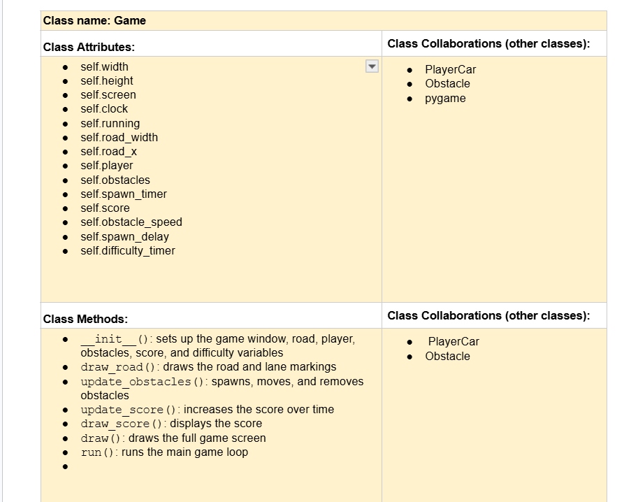
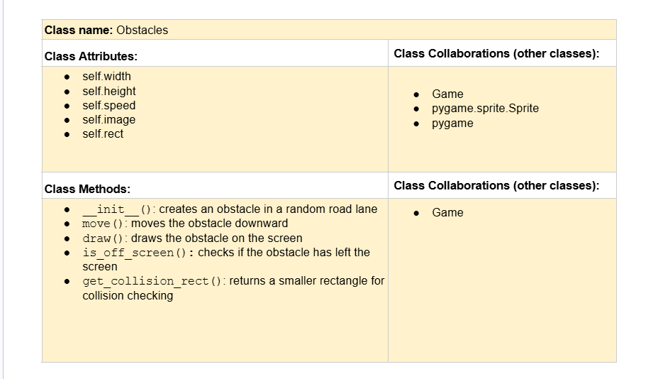
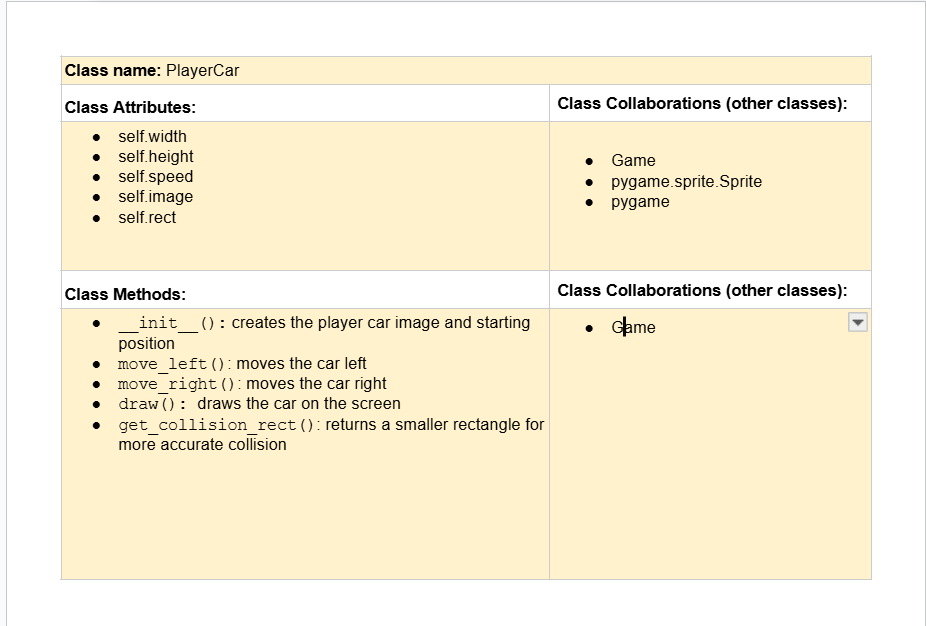

# CSC226 Final Project

## Instructions

❗️Exclamation Marks ❗️indicate action items; you should remove these emoji as you complete/update the items which 
  they accompany. (This means that your final README should have no ❗️in it!)

**Author(s)**: Elom Amuzu and John Lolonga

**Google Doc Link**: https://docs.google.com/document/d/1Q1GhlZha7AW0Bk-vZ2wTr67cs8khxdAAzE6vHVoNrtQ/edit?tab=t.0#heading=h.qg98s23ap4mh

---

## Milestone 1: Setup, Planning, Design  

**Title**: `ROAD RUSH`

**Purpose**: `This project creates a 2D Pygame car-dodging game where the player moves left and right to avoid falling obstacle cars while the speed increases over time.`

️**Source Assignment(s)**: `based on the T11-The Legend of Tuna: Breath of Catnip`

**CRC Card(s)**:
  - Create a CRC card for each class that your project will implement.
  - See this link for a sample CRC card and a template to use for your own cards (you will have to make a copy to edit):
    [CRC Card Example](https://docs.google.com/document/d/1JE_3Qmytk_JGztRqkPXWACJwciPH61VCx3idIlBCVFY/edit?usp=sharing)
  - Tables in markdown are not easy, so we suggest saving your CRC card as an image and including the image(s) in the 
    README. You can do this by saving an image in the repository and linking to it. See the sample CRC card below - 
    and REPLACE it with your own:
  




**Branches**: This project will **require** effective use of git. 

Each partner should create a branch at the beginning of the project, and stay on this branch (or branches of their 
branch) as they work. When you need to bring each others branches together, do so by merging each other's branches 
into your own, following the process we've discussed in previous assignments, then re-branching out from the merged code.  

```
    Branch 1 starting name: amuzue_lolongaj
    Branch 2 starting name: lolongaj
    Branch 3 starting name: amuzue
    Branch 4 starting name: demo_branch
```

### References 

Throughout this project, you will likely use outside resources. Reference all ideas which are not your own, 
and describe how you integrated the ideas or code into your program. This includes online sources, people who have 
helped you, AI tools you've used, and any other resources that are not solely your own contribution. Update this 
section as you go. DO NOT forget about it!

Sources: 
1. https://chatgpt.com/share/69f0f499-f9e8-83ea-84d0-c80b0194eb02
2. T11-The Legend of Tuna: Breath of Catnip - We used the collision code from this team work, modified it and included 
in our code   
3. Bright and Bennie's project - We watched their and tested their game, and from that we improved on our project
4. Google Search - Used it to search up images and ideas for our project, also using it to discover new modules we 
could use from pygame

---

## Milestone 2: Code Setup and Issue Queue

Most importantly, keep your issue queue up to date, and focus on your code. 🙃

❗Reflect on what you’ve done so far. How’s it going? Are you feeling behind/ahead? What are you worried about? 
What has surprised you so far? Describe your general feelings. Be honest with yourself; this section is for you, not me.

```
    So far, the project is going well. We have been able to set up the game window, create the road with three lanes, 
    and implement the player car with left and right movement. We also added falling obstacle cars and started working 
    on collision detection and scoring. Using classes like Game, PlayerCar, and Obstacle has helped keep the project 
    organized and easier to manage.

    I feel like we are making steady progress, but I would not say we are completely ahead. There are still parts that 
    need improvement, especially making the collision detection feel accurate and to have the rect align with the image, 
    and balancing the game difficulty so it is challenging but not impossible. I am also thinking about adding features
    like sound, but I want to make sure the core game works correctly first.
```

---

## Milestone 3: Virtual Check-In

Indicate what percentage of the project you have left to complete and how confident you feel. 

**Completion Percentage**: `90%`

❗️**Confidence**: Describe how confident you feel about completing this project, and why. Then, describe some 
  strategies you can employ to increase the likelihood that you'll be successful in completing this project 
  before the deadline.

```
    I feel confident about completing this project. We already have the main parts working, like the player car, 
    obstacles, movement, and basic collision. The structure with classes is set up, so it’s easier to keep building.
    To stay on track, we will keep working step by step, test each feature as we add it, and update our issue queue 
    regularly. We will also focus on required features first before adding extras features.
```

---

## Milestone 4: Final Code, Presentation, Demo

### User Instructions

In a paragraph, explain how to use your program. Assume the user is starting just after they hit the "Run" button 
in PyCharm. 
```
    When you run the program, a game window will open with a road and a player car at the bottom center. 
    Use the left and right arrow keys to move the car left and right to avoid falling obstacle cars. 
    The game will get faster over time, so try to survive as long as possible. Your score will increase based on how long you survive. 
    If you collide with an obstacle car, the game will end and your final score will be displayed.

```

### ❗Errors and Constraints

❗Every program has bugs or features that had to be scrapped for time. These bugs should be tracked in the issue queue. 
You should already have a few items in here from the prior weeks. Create a new issue for any undocumented errors and 
deficiencies that remain in your code. Bugs found that aren't acknowledged in the queue will be penalized.

### ❗Reflection

❗Each partner should write three to four well-written paragraphs address the following (at a minimum):
- Why did you select the project that you did?
- How closely did your final project reflect your initial design?
- What did you learn from this process?
- What was the hardest part of the final project?
- What would you do differently next time, knowing what you know now?
- How well did you work with your partner? What made it go well? What made it challenging?

```
    Partner 1(John): 
    
    I selected this project because I wanted to create a fun and engaging game that also allowed me to 
    practice my programming skills. I have always enjoyed car games, so making a car-dodging game seemed like a great idea. 
    My final project closely reflected our initial design, as we were able to implement the core design, such as the 
    player car, obstacles, and increasing difficulty. However we did have to make some adjustments along the way, such 
    as tweaking the collision detection and balancing the game difficulty. 
    
    From this process, I learned a lot about game development, working with Pygame, and how to structure a project using 
    classes. Also learned how to collaborate effectively with a partner, especially when it comes to merging code and 
    managing branches. The hardest part of the final project was definitely getting the collision detection to feel 
    accurate and to have the rect align with the image, as it required a lot of trial and error to get it right. What I 
    would do differently next time is to start working on the collision detection earlier in the process, as it ended up 
    taking more time than I expected. Overall, I think we worked well together. We communicated regularly, divided tasks 
    based on our strengths, and were able to merge our code effectively. The main challenge was making sure we were on 
    the same page with the design and implementation, but we were able to overcome that through regular check-ins and 
    updates to our issue queue.
``` 

```
    Partner 2: **Replace this with your reflection  
```

---